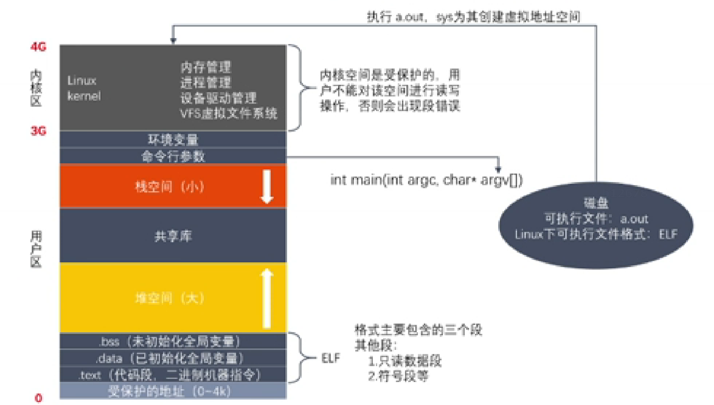
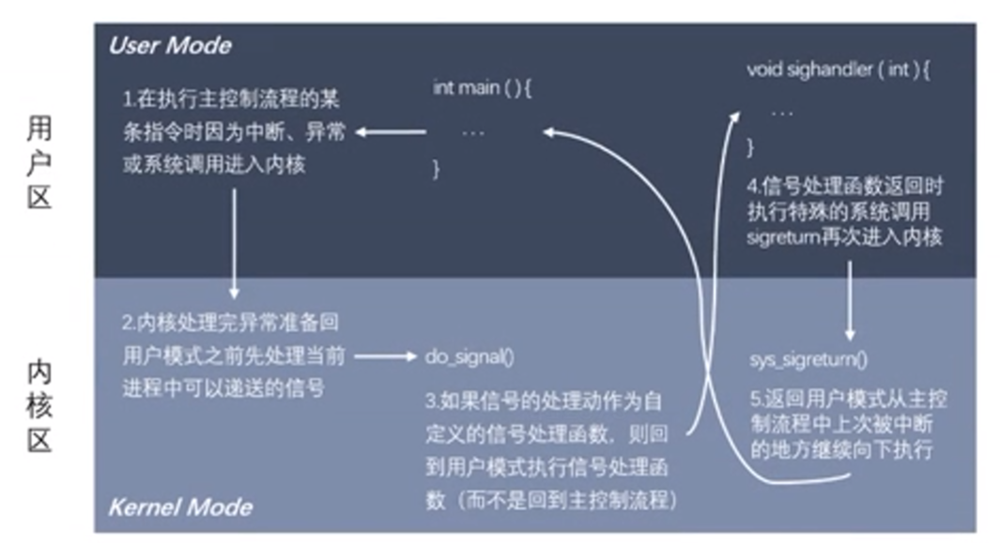
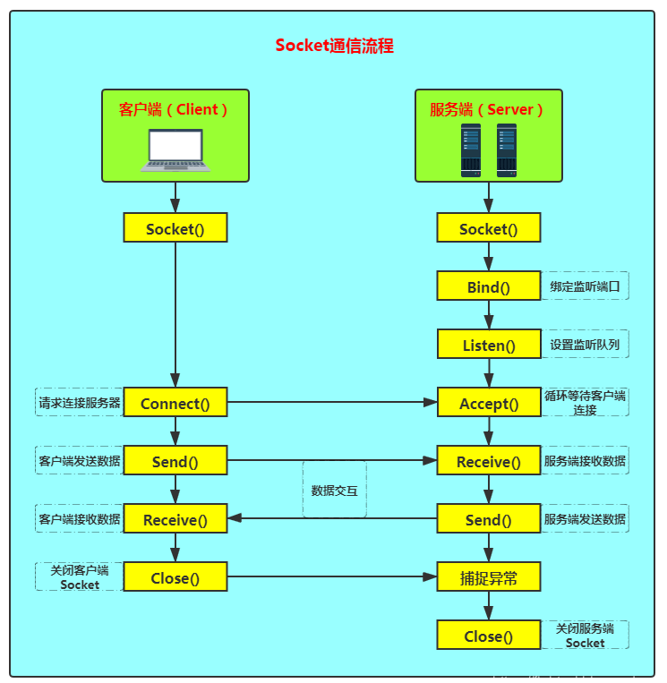
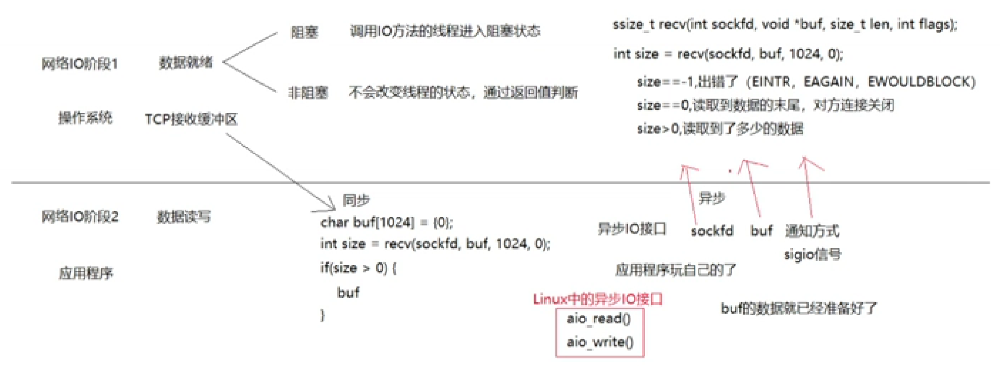
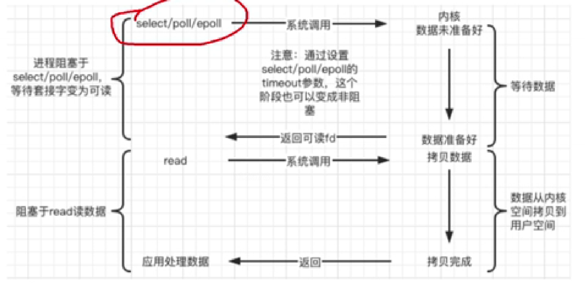
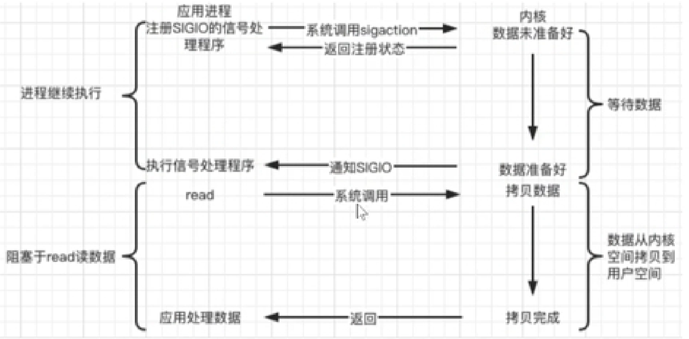
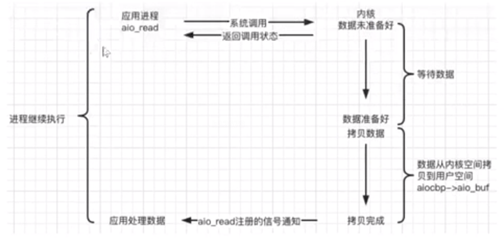

# LearnWebserver
跟着牛客网视频学习一下，自己动手在Linux系统上搭建一个webserver服务器

## Lesson1 Linux开发工具
1. mysql
2. gcc、g++
2. make

| 源文件   | 预处理 | 编译   | 汇编   | 链接     |
|----------|--------|--------|--------|----------|
| test.cpp | test.i | test.S | test.o | test.exe |

3. gdb
4. tree 查看文件目录结构
5. 静态库和动态库，区别以及如何制作
6. 文件io

## Lesson2 多进程
1. 并行和并发
2. 进程控制块（PCB），位于虚拟内存空间中的内核区
3. 进程的状态图——五态图
4. 进程创建，进程退出，进程控制
5. 进程间通信（IPC）方式：
   1. 匿名管道：只能用于有关系的进程之间通信，没有文件名
   2. 有名管道：对应一块内核缓冲区，用文件描述符读写，可用于没有关系的进程之间通信
   3. 内存映射：同一个文件映射到两个进程的虚拟内存中，从一个进程中修改内存 -> 文件被修改 -> 另一个进程中内存同样被修改
   4. 匿名映射：没有中间文件作为载体，只能用于有关系的进程间通信
   5. 信号：  
      1. 对于前台进程，输入Ctrl+C时发送中断信号，终止进程
      2. 定时器信号：SIGALRM信号，到时间后发送这个信号后退出进程
      3. 内核实现信号捕捉
       
   6. 共享内存：创建共享内存段 -> 两个进程分别关联共享内存 -> 直接操作内存进行通信 -> 解除关联 -> 释放共享内存。  
      共享内存只有在所有与之关联的进程都解除关联才会销毁
   7. socket通信：

## Lesson3 多线程
1. 线程和进程区别：进程会复制新的虚拟地址空间，线程共用虚拟地址空间，不过栈空间和text段不共享，各个线程独立分配栈空间；线程间通信更方便；线程创建更快。
2. 线程同步：多线程对共享数据操作时可能产生不安全操作。
    1. 互斥锁：使用资源前加锁，用完后解锁
    2. 死锁：忘记释放锁、多次加相同锁、多线程多锁时锁被其他线程获取
    3. 读写锁：读多写少时用读写锁
    4. 生产者消费者模型：条件变量，信号量

## Lesson4 网络编程
1. 数据链路层 -> 网络层 -> 传输层 -> 应用层  
数据链路层：作为传输数据的物理媒介。ARP协议
网络层：IP协议、ICMP协议
传输层：TCP、UDP协议
应用层：http、https、ftp
2. socket（套接字）：是一套通信的接口  
    1. socket地址：封装了ip和端口信息
    2. 服务器端申请TCP缓冲，返回文件描述符；绑定ip和端口；监听socket上的连接；接受客户端连接（阻塞的）
    
    3. 客户端connect连接服务器
3. 字节序：多个字节在内存中的顺序。大端字节序、小端字节序。不同机器字节序不同，所以规定在通信时全部数据都转换为大端字节序，即主机字节序（大端或小段）转换为网络字节序（大端）。
4. 三次握手  
客户端发信号，SYN置一
服务器收到信号后，服务端知道客户端发没问题，自己收没问题；服务端发信号，ack置一，syn置一
客户端收到信号后，客户端知道自己发、收，服务器发、收没问题；客户端发信号，ack置一
服务端收到信号后，知道自己发，客户端收没问题。
5. 四次挥手  
客户端发信号，FIN置一
服务端发信号，ack置一，此时客户端不能发数据了，但是服务端还可以给客户端发数据
服务端发信号，FIN置一，不能和上一个信号合并，因为服务端可能还有数据要发送给客户端
客户端发信号，ack置一
6. 三次握手四次挥手状态转换
7. 滑动窗口
8. 端口复用：防止服务器重启之前绑定的端口还未释放；程序突然退出而系统没有释放端口
9. TCP通信并发：利用多线程或多进程  
思路：一个父进程，多个子进程；父进程等待并接受客户端；一个客户端请求就新建一个子进程
10. I/O多路复用：使得程序能同时监听多个文件描述符
    1. select/poll：首先构造一个关于文件描述符的列表，将监听的文件描述符添加进去；内核同时监听这些文件描述符；只告诉程序有几个请求到了；poll解决select每次只能监听1024个描述符的问题
    2. epoll:告诉程序哪几个请求到了。先在内核中创建epoll对象，返回文件描述符  
    ET模式配合非阻塞文件描述符比LT模式效率高。

## Lesson5 项目实战
1. 阻塞/非阻塞、同步/异步（网络I/O）

阻塞/非阻塞是指有无数据到了，通过设置文件描述符的标志来实现。阻塞是等待缓冲区数据就绪后继续执行；非阻塞情况根据返回值判断。  
同步/异步是指从TCP缓冲区读取获取数据的过程，通过调用不同的api来实现。同步效率低，需要用户等着把数据从内核区拷贝到用户区，耗费用户时间，编程简单；异步效率高，内核帮忙拷贝数据，拷贝完成后发送通知，编程复杂。
2. Linux上五种IO模型，每种模型有相应的api
    1. 阻塞blocking：线程挂起，等待时不会消耗任何资源
    2. 非阻塞 non_blocking：线程不会挂起，可以做其他事，但是while循环中一直消耗资源
    3. I/O复用：
    
    4. 信号驱动：
    
    5. 异步：调用aio_read、aio_write实现
    
3. http协议
    1. 请求报文头
    2. 响应报文头
    3. get、post等各种请求方式
    4. http状态码
4. 服务器编程基本框架
5. 两种高效的事件处理模式
    1. Reactor模式，用同步I/O实现。主线程只负责监听文件描述符，socket上的可读可写事件都交付工作线程。
    2. Proactor模式，用异步I/O实现。主线程不仅监听文件描述符，有数据时通过异步I/O读取，准备好了数据之后再进入工作线程。
6. 线程池